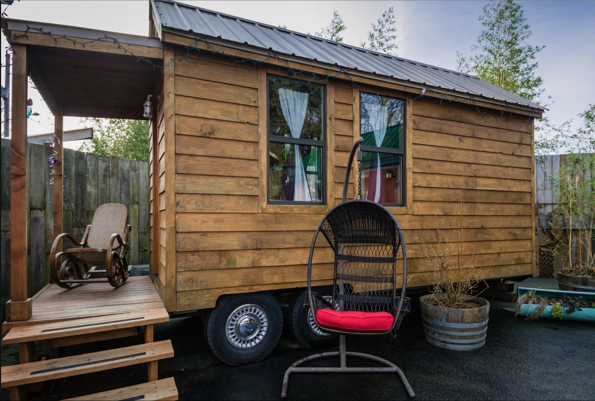

# PyCon 2016/DjangoCon 2016

# Why Conference?

## Obvious
-  Technical Sessions
-  Tutorials

# Why Conference?

## Less obvious, more valuable?
-  Networking
    +  Future job leads
    +  Partners for interesting projects
    +  Job Fair
-  Open Spaces/BoF (live)
-  Lightning Talks (recorded)
-  Poster Sessions (live)
-  Random serendipitous conversations
    +  Breakfast w/ Nicole
    +  Meeting various random people at lunch & in tutorials
-  SPRINTS!
-  Visit another city
    +  Would you want to move/work here?
    +  Family there?

# PyCon: Retrospective
# General
-  Huge
-  Overwhelming
-  My first time in Portland. The city is `#PDXAF`

# Specific
-  Tutorials were great and worth the money. But 4 may have been too many. But I got to meet Harry Percival, who's awesome.
-  I gave up on trying to go to all the talks. Videos were going up REALLY fast!
-  Would definetly PyCon and Portland again

# People I met you may have heard of
-  @nedbat: he remembered me from sprint tutorials AND helped me learn to juggle bowling pins!
-  @hwjp: introduced me to his ORA editor.
-  @heddle317‬: got to thank her for her onboarding videos. She may have thought I was a crazy person. I'd also met a college friend of hers at DjangoCon last year
-  Guido! Got TWO pics w/ him. He looks suspicious of me. :-( But he's super-awesome!
-  Kenneth Reitz: didn't talk to him much, but got a Requests sticker!
-  ‪@BruceEckel‬: yes, THAT Bruce Eckel!
-  @pydanny: I didn't get to talk to his wife, ‪@audreyr‬
-  Frank Wiles of RevSys, the newest DSF President
-  @kennethlove of Treehouse and DjangoGirls and #CodeNewbie

# People I met you may NOT have heard of
-  A BUNCH of PyLadies_pdx folks and organizers
-  The PyCon 2016 Lightning Talks co-chair (who helped me with ideas)
-  An oceanographer from Brasil who wants to become a dev
-  The DjangoGirlsNYC organizer and a fellow #CodeNewbie
-  Two OTHER #CodeNewbies that I'd talked to on Twitter and on Slack
-  A woman from Seattle in a tutorial with me, who *seemed* quite interesting. And *WAS*, once I talked to her.
-  A woman in SF helping kids learn to cook AND code!
-  @glasnt, who works on BeeWare with ‪@freakboy3742‬ 
-  An old man who'd just shoplifted beer and wine from a grocery store. And was BRAGGING about it. He'd also just accepted the stub of a joint from a stranger (NOT part of PyCon. Just outside the OCC #PDXAF)

# Caravan Tiny House Hotel
-  I like tiny houses. NO ONE else cares. I stayed in the [Rosebud](http://tinyhousehotel.com/rosebud)

# [DjangoCon](https://2016.djangocon.us/): Prologue

## General
-  Philadelphia July 17-22
    +  17: Tutorials
    +  18-20: Talks
    +  21-22: Sprints

## Specific
-  Day -30:
    -  Why are you going? What do you want to get out of it?
-  Preparing
    -  [Talks](https://2016.djangocon.us/blog/2016/05/25/announcing-our-talk-line/)
        -  My recommendations
    -  [Tutorials](https://2016.djangocon.us/blog/2016/05/25/announcing-our-tutorial-line/)
        -  My recommendations
-  [Al's take](-  https://automatetheboringstuff.com/how-to-do-pycon-or-any-tech-conference/)